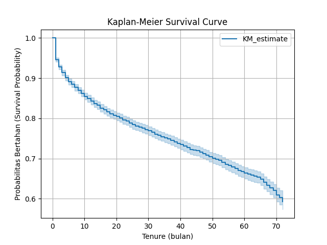
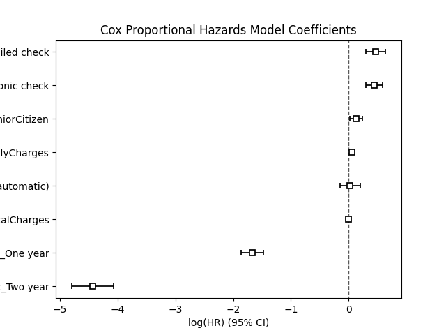
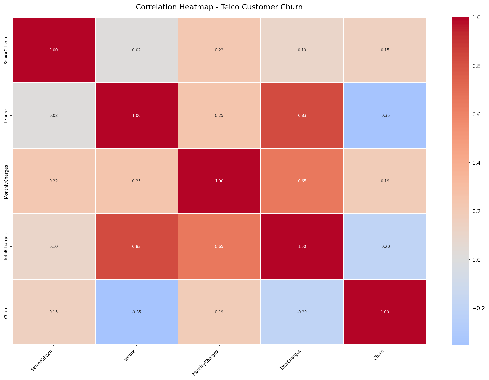

# Telco Customer Survival Analysis using Kaplan-Meier and Cox Proportional Hazards

This project applies **Survival Analysis** to understand customer churn behavior in a telecommunications company. Using the **Kaplan-Meier Estimator** and **Cox Proportional Hazards Model**, the analysis estimates customer retention over time and identifies the factors that significantly influence churn risk.

---

## Project Overview

Customer churn is a major challenge for telecommunication companies because losing existing customers increases acquisition costs and reduces revenue.

Unlike traditional classification models, **Survival Analysis** predicts not only **whether** a customer will churn but also **when** the churn is likely to occur.

This project demonstrates the implementation of Survival Analysis using Python and the **lifelines** library.

---

## Dataset

**Dataset:** Telco Customer Churn Dataset

Source:
https://www.kaggle.com/datasets/blastchar/telco-customer-churn

### Features

| Feature | Description |
|----------|-------------|
| tenure | Customer subscription duration (months) |
| Churn | Customer churn status |
| MonthlyCharges | Monthly service charge |
| TotalCharges | Total amount paid |
| Contract | Contract type |
| PaymentMethod | Payment method |
| SeniorCitizen | Senior citizen status |

Dataset contains:

- **7,043 customers**
- **1,869 churn events**
- **5,174 censored observations**

---

## Objectives

- Estimate customer survival probability using Kaplan-Meier.
- Identify significant churn factors using Cox Proportional Hazards.
- Analyze customer retention over time.
- Support business decision-making with survival analysis.

---

## Technologies

- Python
- Pandas
- NumPy
- Matplotlib
- Seaborn
- Lifelines
- Scikit-learn

---

## Repository Structure

```text
telco-customer-survival-analysis
│
├── data
│   └── Telco-Customer-Churn.csv
│
├── images
│   ├── kaplan_meier_curve.png
│   ├── cox_coefficients.png
│   └── correlation_heatmap.png
│
├── survival_analysis.py
├── Telco_Customer_Survival_Analysis_Report.pdf
├── README.md
├── requirements.txt
└── .gitignore
```

---

# Data Preprocessing

The following preprocessing steps were performed before model development:

- Removed missing values from **TotalCharges**
- Converted **TotalCharges** to numeric format
- Converted **Churn** into binary values
- Applied one-hot encoding to categorical variables
- Selected relevant variables for survival analysis

---

# Kaplan-Meier Survival Curve



The Kaplan-Meier estimator illustrates the probability that customers remain subscribed over time.

### Findings

- Customer survival probability decreases over time.
- The highest churn risk occurs during the first year.
- Customers who remain after the early months tend to be more loyal.

---

# Cox Proportional Hazards Model



The Cox model evaluates how customer characteristics influence churn risk.

## Model Performance

| Metric | Value |
|--------|------:|
| Number of Customers | 7043 |
| Churn Events | 1869 |
| Concordance Index | **0.93** |
| Partial AIC | 25543.70 |

A Concordance Index of **0.93** indicates excellent predictive performance.

---

# Correlation Analysis



The correlation heatmap provides an overview of relationships among numerical variables before survival modeling.

---

# Key Findings

### Customers with One-Year Contracts

- Hazard Ratio = **0.19**
- Approximately **81% lower churn risk** than monthly contracts.

---

### Customers with Two-Year Contracts

- Hazard Ratio = **0.01**
- Approximately **99% lower churn risk**.

---

### Monthly Charges

- Hazard Ratio = **1.05**
- Higher monthly fees increase churn risk.

---

### Payment Method

Customers using:

- Electronic Check
- Mailed Check

have significantly higher churn risk than customers using automatic payment methods.

---

### Senior Citizens

Senior customers have a slightly higher probability of churn than non-senior customers.

---

# Business Insights

The analysis suggests several actionable strategies:

- Encourage customers to switch to longer-term contracts.
- Promote automatic payment methods to reduce churn.
- Monitor customers with high monthly charges.
- Develop targeted retention programs for senior customers.
- Focus retention efforts during the customer's first year.

---

# How to Run

Clone this repository

```bash
git clone https://github.com/hannazan/telco-customer-survival-analysis.git
```

Move to project directory

```bash
cd telco-customer-survival-analysis
```

Install dependencies

```bash
pip install -r requirements.txt
```

Run the analysis

```bash
python survival_analysis.py
```

---

# Conclusion

This project demonstrates the application of **Survival Analysis** for customer churn prediction using the Kaplan-Meier estimator and Cox Proportional Hazards model.

The results show that contract type, payment method, monthly charges, and senior citizen status significantly influence customer retention. The Cox model achieved a **Concordance Index of 0.93**, indicating excellent predictive performance.

---

## Author

**Hanna Zahra Nadia**

- GitHub: https://github.com/hannazan
- LinkedIn: https://linkedin.com/in/hannazan